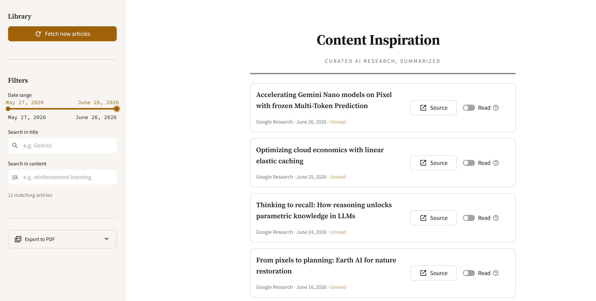
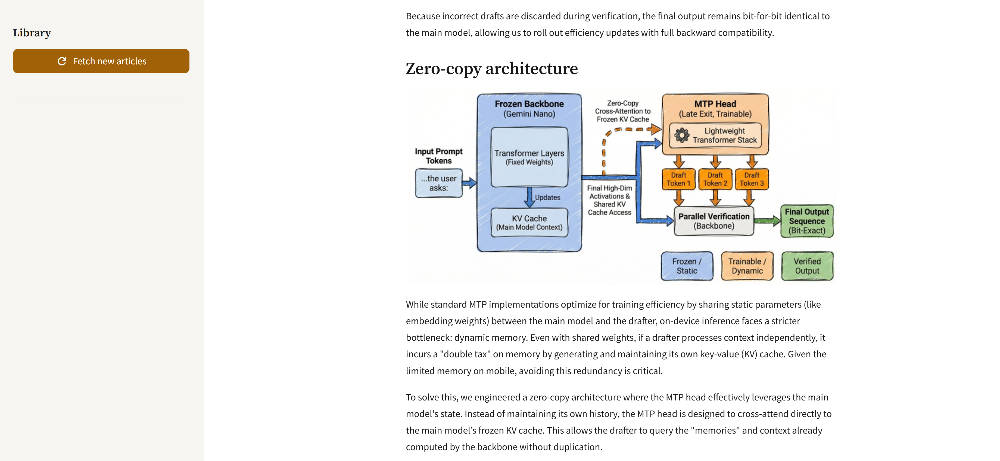

# 🌟 Content Inspiration

> *A powerful Streamlit web application that intelligently scrapes and summarizes articles from the Google AI Blog, featuring automated content processing, image management, and AI-powered insights.*

<div align="center">

[](https://python.org)
[](https://streamlit.io)
[](https://ollama.ai)
[](LICENSE)

</div>

---

## ✨ Key Features

<div align="center">
<table>
<tr>
<td align="center" width="33%" valign="top">

<h3>Smart Collection</h3>
<p>Automatically discovers and extracts article links from Google AI Blog with intelligent parsing</p>
</td>
<td align="center" width="33%" valign="top">

<h3>AI-Powered Processing</h3>
<p>Generates comprehensive summaries using local Ollama models for enhanced content understanding</p>
</td>
<td align="center" width="33%" valign="top">

<h3>Interactive Dashboard</h3>
<p>Browse, search, and filter content through an intuitive Streamlit interface</p>
</td>
</tr>
</table>
</div>

### 🚀 Core Capabilities

- **📄 Content Processing** → Downloads and structures article content with metadata
- **🖼️ Image Management** → Automatically retrieves and organizes article images
- **⚙️ Flexible Configuration** → Easy setup through YAML configuration files
- **🔍 Advanced Search** → Powerful filtering and discovery tools
- **📊 Content Analytics** → Insights into your scraped content library

---

## 📸 Screenshots

<div align="center">
<table>
<tr>
<td align="center" width="50%">

<br/>
<sub>Article library — search, date filtering, and PDF export</sub>
</td>
<td align="center" width="50%">

<br/>
<sub>Reader view — editorial typography with inline images</sub>
</td>
</tr>
</table>
</div>

---

## 🏗️ Project Architecture

```
content-inspiration/
│
├── 📋 config/
│   └── config.yaml              # Application configuration
│
├── 📁 data/
│   ├── processed/               # Processed article storage
│   └── raw/                     # Raw scraped links
│
├── 🖼️ images/                   # Downloaded article images
│
├── 📝 logs/                     # Application logs
│
├── 🔧 src/
│   ├── utils/                   # Core utility modules
│   └── websites/                # Scraping logic & main app
│
├── 🚀 main.py                   # Streamlit application entry point
├── 📋 requirements.txt          # Python dependencies
└── 🏃‍♂️ run_app.bat               # Windows launch script
```

---

## 🛠️ Installation Guide

### Prerequisites

<div align="center">

| Component | Requirement | Installation |
|-----------|-------------|--------------|
| 🐍 **Python** | 3.10+ | [Download Here](https://python.org) |
| 🦙 **Ollama** | Latest | [Install Guide](https://ollama.ai/) |
| 🌐 **Environment** | Variables | Configuration needed |

</div>

### Quick Setup

#### **1️⃣ Clone Repository**
```bash
git clone https://github.com/AdemCE-eng/Content_Inspiration.git
cd content_inspiration
```

#### **2️⃣ Environment Setup**
```bash
# Create virtual environment
python -m venv venv

# Activate environment
# Windows:
venv\Scripts\activate
# macOS/Linux:
source venv/bin/activate
```

#### **3️⃣ Install Dependencies**
```bash
pip install -r requirements.txt
```

#### **4️⃣ Configure Environment**
Create `.env` file in project root:
```env
USER_AGENT="Mozilla/5.0 (Windows NT 10.0; Win64; x64) AppleWebKit/537.36 (KHTML, like Gecko) Chrome/91.0.4472.124 Safari/537.36"
```
   > **Note**: Replace with your actual browser's user agent string. You can find this by searching "what is my user agent" in your browser.

#### **5️⃣ Setup Ollama**
```bash
# Install required model
ollama pull mistral

# Service starts automatically when needed
```

---

## 🎯 Usage Instructions

### Launch Application

<div align="center">
<table>
<tr>
<td width="48%" align="center">

**🖥️ Command Line**
```bash
streamlit run main.py
```

</td>
<td width="4%">
</td>
<td width="48%" align="center">

**🪟 Windows Batch**
```bash
run_app.bat
```

</td>
</tr>
</table>
</div>

#### **📋 Step-by-Step Process**

1. **🌐 Access Interface** → Navigate to `http://localhost:8501`
2. **⚡ Run Pipeline** → Execute 4-step scraping process via sidebar
   - **Step 1** → Scrape article links from Google AI Blog
   - **Step 2** → Download article content and metadata
   - **Step 3** → Download and organize images
   - **Step 4** → Generate AI summaries
3. **🔍 Explore Content** → Use interactive features for content discovery

---

## ⚙️ Configuration

### Main Configuration (`config/config.yaml`)

| Setting Category | Description |
|------------------|-------------|
| **📁 Storage Settings** | Configure data paths, image storage locations, and log file destinations |
| **🌐 Source URLs** | Define target websites (Google AI Blog) and scraping endpoints |
| **🤖 AI Model Settings** | Set up Ollama configuration, model selection (`mistral` default), and processing timeouts |
| **🎨 UI Preferences** | Customize articles per page and interface settings |

### 🔧 Custom Model Configuration
To use a different AI model, modify `config/config.yaml`:
```yaml
ollama:
  model: "your-preferred-model"  # Change from default 'mistral'
```

---

## 🚨 Troubleshooting

| ❌ **Problem** | ✅ **Solution** |
|----------------|-----------------|
| **Ollama Connection Failed** | Ensure Ollama CLI is installed and model is pulled (`ollama pull mistral`) |
| **User Agent Blocked** | Update `.env` with current browser user agent string |
| **File Permission Denied** | Check write permissions for `data/` and `images/` directories |
| **Module Import Error** | Reinstall dependencies: `pip install -r requirements.txt` |
| **Port Already in Use** | Change Streamlit port: `streamlit run main.py --server.port 8502` |

### 🔍 Debug Tips
- Check logs in `logs/` directory
- Verify Ollama service status: `ollama list`
- Test user agent at: `httpbin.org/user-agent`

---

## 🤝 Contributing

We welcome contributions! Here's how to get started:

### **Development Workflow**

```bash
# 1. Fork the repository on GitHub

# 2. Clone your fork
git clone https://github.com/YOUR-USERNAME/Content_Inspiration.git

# 3. Create feature branch
git checkout -b feature/amazing-feature

# 4. Make your changes and commit
git commit -m 'Add amazing feature'

# 5. Push to your fork
git push origin feature/amazing-feature

# 6. Create Pull Request
```
---

## 📄 License

<div align="center">

This project is licensed under the **MIT License**

See the [LICENSE](LICENSE) file for full details

</div>

---

## 🙏 Acknowledgments

<div align="center">

### **Special Thanks**

🏢 **[Google AI Blog](https://ai.googleblog.com/)** → *For providing excellent technical content*

🦙 **[Ollama Team](https://ollama.ai/)** → *For local AI model infrastructure*

🎨 **[Streamlit](https://streamlit.io/)** → *For the intuitive web framework*

🐍 **Python Community** → *For the amazing ecosystem of libraries*

---

<div align="center">
<sub>Built with ❤️ and lots of ☕</sub>

<br><br>

**[⭐ Star this repo](https://github.com/AdemCE-eng/Content_Inspiration)** • **[🐛 Report Bug](https://github.com/AdemCE-eng/Content_Inspiration/issues)** • **[💡 Request Feature](https://github.com/AdemCE-eng/Content_Inspiration/issues)**

</div>

</div>